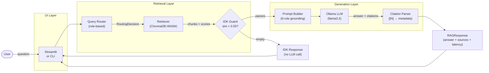

# Local Wikipedia RAG Assistant

**Fully local, privacy-preserving question answering over 44 Wikipedia entities — zero cloud dependencies.**

[](https://www.python.org/)
[](LICENSE)
[](#evaluation-results)
[](#)

> Course project for BLG483E — Information Retrieval and Search Engines (ITU, 2026)

---

<!-- Replace the line below with an actual screenshot or GIF once the UI is running -->
<!--  -->

---

## Overview

This system answers natural-language questions about 22 famous people and 22 famous landmarks
by retrieving relevant passages from locally-indexed Wikipedia articles and grounding a local
language model's answers strictly to those passages.

**Who it's for:** Students and researchers who want to understand how RAG works at the
systems level — chunking strategy, embedding geometry, vector similarity, prompt engineering
for grounding — rather than calling a high-level library that hides the mechanics.

**Why local-first?** Every component (embedding model, vector database, LLM inference) runs
on your machine. No query ever leaves localhost after the initial Wikipedia fetch. There are no
API keys, no usage costs, and no dependency on external service availability.

---

## Features

- **44-entity corpus** — 22 people + 22 places, each a full Wikipedia article chunked into
  ~400-token passages with section-level metadata
- **Rule-based query router** — classifies queries as `person`, `place`, `both`, or
  `unknown` using entity-name matching and keyword scoring in < 1 ms
- **Single ChromaDB collection** (Option B architecture) — one HNSW index with metadata
  filters; enables cross-entity comparison queries without per-type collection overhead
- **Local embedding** — [BAAI/bge-small-en-v1.5](https://huggingface.co/BAAI/bge-small-en-v1.5)
  (384-dim, MTEB 62.17) via sentence-transformers; no Ollama dependency for embedding
- **Local LLM** — Ollama with `llama3.2` (default); configurable to `phi3`, `mistral`, or
  any Ollama-compatible model
- **Strict grounding** — 6-rule system prompt + temperature 0.1 + similarity threshold guard;
  three independent layers preventing hallucination
- **"I don't know" fallback** — out-of-corpus queries are rejected before the LLM is called;
  structurally zero hallucination risk for unindexed topics
- **Streamlit chat UI** — streaming responses, citation expanders, model/threshold controls
- **Rich terminal CLI** — REPL with `/route`, `/stats`, `/sources` debug commands

---

## Architecture



**Data flow summary:**

```
User query
  │
  ├─ Router classifies intent (person / place / both / unknown)
  │
  ├─ Retriever embeds query → cosine search → top-5 passages
  │
  ├─ IDK Guard: score < 0.55 → return IDK immediately, never call LLM
  │
  ├─ Prompt Builder: format numbered passages + strict 6-rule system prompt
  │
  ├─ LLM generates answer grounded to passages (stream or blocking)
  │
  └─ Citation Parser: extract [N] refs → map to Wikipedia source metadata
```

---

## Prerequisites

| Requirement | Version | Notes |
|-------------|---------|-------|
| Python | 3.9+ | Tested on 3.9.18 |
| [Ollama](https://ollama.com/download) | latest | LLM inference daemon |
| RAM | 8 GB min, 16 GB recommended | 16 GB for smooth llama3.2 inference |
| Disk space | ~4 GB | ~2 GB model + ~2 GB embedding cache + DB |
| Internet | Required for ingestion only | Zero outbound calls at query time |

---

## Installation

```bash
# 1. Clone the repository
git clone https://github.com/salihsefer36/Local-Wikipedia-RAG-Assistant.git
cd Local-Wikipedia-RAG-Assistant

# 2. Create and activate a virtual environment
python -m venv .venv
source .venv/bin/activate          # macOS / Linux
# .venv\Scripts\activate           # Windows

# 3. Install Python dependencies
pip install -r requirements.txt

# 4. Install and start Ollama, then pull the default model
# Download Ollama from https://ollama.com/download
ollama serve &                     # start the daemon (or run Ollama.app on macOS)
ollama pull llama3.2               # ~2.0 GB — default model
```

> The embedding model (`BAAI/bge-small-en-v1.5`) is downloaded automatically on first run
> via `sentence-transformers` and cached locally. No separate pull command is needed.

---

## Setup: Building the Knowledge Base

Run the pipeline scripts in order. Each script validates its own output before continuing.

```bash
# Step 1 — Fetch Wikipedia articles for all 44 entities (~15 min, one-time)
python scripts/01_fetch_wikipedia.py

# Step 2 — Validate and clean the raw data
python scripts/01b_validate_data.py

# Step 3 — Chunk articles into ~400-token passages
python scripts/02a_chunk_documents.py

# Step 4 — Inspect chunk quality (writes data/processed/_chunking_report.md)
python scripts/02b_inspect_chunks.py

# Step 5 — Embed all chunks and load into ChromaDB (~5 min)
python scripts/02_build_index.py

# Step 6 — Smoke test: verify routing + retrieval + LLM end-to-end
python scripts/03_smoke_test.py
```

After `02_build_index.py` completes, the vector database at `db/` will contain ≥ 400 chunks
across 44 entities. To reset the database and re-index from scratch:

```bash
python scripts/02_build_index.py --reset
```

---

## Usage

### Streamlit Chat UI

```bash
streamlit run ui/streamlit_app.py
# Open http://localhost:8501 in your browser
```

The sidebar lets you switch models, adjust the retrieval top-K, and tune the similarity
thresholds without restarting the server. Each assistant response shows a
**📚 View Sources** expander with routing debug info, latency breakdown, and cited
Wikipedia passages with relevance scores.

### Terminal CLI

```bash
python ui/cli.py
# or
python main.py --mode cli
```

```
>>> What did Einstein win the Nobel Prize for?
>>> /route Compare Tesla and the Eiffel Tower       # debug routing only
>>> /sources                                         # full source detail for last answer
>>> /stats                                           # DB chunk counts
>>> /help                                            # all commands
>>> /exit
```

### Example Queries

| Query | Expected routing | Key facts returned |
|-------|------------------|--------------------|
| "What did Einstein win the Nobel Prize for?" | person | Photoelectric effect (1921) |
| "How tall is the Eiffel Tower and when was it built?" | place | 330 m tall, completed 1889 |
| "Compare Marie Curie and Nikola Tesla" | both | 2× Nobel / AC motor + patents |
| "Who discovered polonium?" | person | Marie Curie, 1898 |
| "What is the best sourdough recipe?" | unknown (OOC) | "I don't know based on the available information." |

---

## Configuration

All settings live in `src/config.py` and can be overridden via environment variables or a
`.env` file at the project root (see `.env.example`).

| Variable | Default | Description |
|----------|---------|-------------|
| `LLM_MODEL` | `llama3.2` | Ollama model name |
| `OLLAMA_BASE_URL` | `http://localhost:11434` | Ollama daemon URL |
| `LLM_TEMPERATURE` | `0.1` | Sampling temperature (lower = more grounded) |
| `LLM_MAX_TOKENS` | `512` | Maximum tokens per generated answer |
| `EMBEDDING_MODEL` | `BAAI/bge-small-en-v1.5` | sentence-transformers model ID |
| `EMBED_BATCH_SIZE` | `32` | Chunks per embedding batch |
| `TOP_K` | `5` | Passages retrieved per query |
| `CHUNK_SIZE` | `400` | Tokens per passage (chunking) |
| `CHUNK_OVERLAP` | `80` | Overlap tokens between consecutive chunks |
| `SIMILARITY_THRESHOLD_LOW` | `0.55` | Below → IDK (LLM never called) |
| `SIMILARITY_THRESHOLD_MID` | `0.70` | Below → hedged low-confidence response |

Example `.env` override to use a different model:

```bash
LLM_MODEL=phi3
LLM_TEMPERATURE=0.05
TOP_K=8
```

---

## Project Structure

```
Local-Wikipedia-RAG-Assistant/
│
├── data/
│   ├── raw/                        # Raw Wikipedia JSON (fetched by script 01)
│   ├── processed/                  # Validated + chunked data + reports
│   ├── eval_report.md              # Retrieval evaluation report
│   └── final_eval_report.md        # Full acceptance-criteria audit
│
├── db/                             # ChromaDB persistent storage (HNSW index)
│
├── docs/
│   └── BLG483E - HW3.pdf          # Assignment specification
│
├── scripts/
│   ├── 01_fetch_wikipedia.py       # Fetch raw articles via Wikipedia API
│   ├── 01b_validate_data.py        # Validate + clean raw JSON
│   ├── 02a_chunk_documents.py      # Section-aware chunking
│   ├── 02b_inspect_chunks.py       # Chunk quality inspection
│   ├── 02_build_index.py           # Embed + load into ChromaDB
│   ├── 03_smoke_test.py            # End-to-end pipeline smoke test
│   ├── 03a_test_embedder.py        # Embedder unit smoke test
│   ├── 04a_test_vector_store.py    # Vector store smoke test
│   └── 05_test_llm.py              # LLM client smoke test
│
├── src/
│   ├── config.py                   # Settings (pydantic-settings) + entity catalog
│   ├── chunker.py                  # Section-aware Wikipedia passage chunker
│   ├── embedder.py                 # BAAI/bge-small-en-v1.5 wrapper + disk cache
│   ├── ingest.py                   # Wikipedia fetch, clean, normalize
│   ├── llm.py                      # OllamaLLM — generate, stream, retry, health check
│   ├── prompts.py                  # Grounded 6-rule system prompt templates
│   ├── rag_pipeline.py             # RAGPipeline — end-to-end orchestration
│   ├── retriever.py                # Retriever — semantic search + entity coverage
│   ├── router.py                   # QueryRouter — rule-based intent classification
│   ├── utils.py                    # Token counting, text cleaning helpers
│   └── vector_store.py             # ChromaVectorStore — single-collection wrapper
│
├── tests/
│   ├── conftest.py                 # Pytest markers, shared fixtures
│   ├── eval_retrieval.py           # Standalone retrieval evaluation script
│   ├── test_e2e.py                 # 26-query end-to-end evaluation (68 tests)
│   ├── test_no_hallucination.py    # Anti-hallucination + grounding tests
│   ├── test_performance.py         # Latency benchmarks (retrieval + pipeline)
│   ├── test_chunker.py             # Chunker unit tests
│   ├── test_retriever.py           # Retriever unit tests (mocked store)
│   ├── test_router.py              # Router unit tests (29 cases)
│   └── test_smoke.py               # Config + catalog smoke tests
│
├── ui/
│   ├── cli.py                      # Rich terminal REPL
│   └── streamlit_app.py            # Streamlit chat interface
│
├── main.py                         # Entry point (--mode ui | cli)
├── product_prd.md                  # Product Requirements Document
├── recommendation.md               # Option A vs B architecture decision
├── requirements.txt                # Pinned dependencies
└── README.md
```

---

## How It Works

### 1. Ingestion and Indexing

Wikipedia articles for each entity are fetched via the Wikipedia API, cleaned (references and
markup stripped), and split into passages using a section-aware chunker. Each chunk is ~400
tokens with 80-token overlap and carries metadata: `entity_id`, `entity_type`,
`section_heading`, `source_url`, and token count. All passages are embedded with
`BAAI/bge-small-en-v1.5` (384 dimensions, asymmetric retrieval with a BGE query prefix) and
stored in a single ChromaDB collection using cosine distance. This **Option B** architecture
places all entity types in one collection, which enables cross-entity comparison queries
(`"Compare Einstein and the Eiffel Tower"`) without requiring post-hoc result merging.

### 2. Query Routing

Every query passes through a rule-based router before reaching the vector store. The router
runs a four-step priority cascade in under 1 ms: (1) exact entity name match → decisive
`person` or `place` routing; (2) absorbed-word partial match — entity names absorb their
component tokens to prevent cross-contamination (e.g., `"lincoln memorial"` absorbs `"lincoln"`
so Abraham Lincoln is not erroneously matched); (3) keyword scoring — predefined person
and place keyword sets with a zero-opposing-keyword shortcut (`person_kw > 0 and place_kw == 0
→ person` without requiring a margin); (4) score margin threshold with a `both` fallback for
ambiguous comparison queries. Routing to `unknown` causes retrieval to proceed unfiltered,
relying entirely on the similarity threshold to gate the response.

### 3. Retrieval and the IDK Guard

A single unfiltered ChromaDB HNSW query retrieves the top-K passages by cosine similarity.
For `both` queries, score-based merging naturally interleaves passages from different entities
ranked by relevance. If a named entity is detected in the query but absent from the top-K
results, an entity-coverage enforcement step fires a targeted secondary query to guarantee
representation. Any query whose maximum similarity score falls below **0.55** returns an
immediate `"I don't know based on the available information."` response — the LLM is never
called. This threshold-based gate is the first of three anti-hallucination layers and provides
a structural, not probabilistic, guarantee that out-of-corpus queries cannot produce invented
answers.

### 4. Prompt Construction and LLM Generation

Retrieved passages are formatted as a numbered block with entity name, section heading, and
relevance score, inserted between `--- PASSAGES ---` delimiters in the system prompt. The
system prompt enforces six operational rules: correct false premises before answering; trace
every factual claim to an exact passage sentence; say "I don't know" if answering requires any
knowledge beyond the passages; keep facts from different entities separate; respond
concisely; and suppress meta-commentary. With `temperature=0.1` the model operates in
summarization mode, minimizing creative confabulation. Queries scoring between 0.55 and 0.70
activate a seventh rule requiring the model to acknowledge partial relevance. After generation,
a citation parser extracts `[N]` passage references from the answer and resolves them to
Wikipedia source metadata, which is returned alongside the answer in a structured `RAGResponse`.

For a detailed architecture comparison (Option A vs Option B) and tradeoff analysis, see
[`recommendation.md`](recommendation.md). For acceptance criteria and success metrics, see
[`product_prd.md`](product_prd.md).

---

## Evaluation Results

Evaluated on a 4-entity development corpus (Albert Einstein, Marie Curie, Nikola Tesla,
Eiffel Tower) — 26 queries, 189 tests passing. Full results in
[`data/final_eval_report.md`](data/final_eval_report.md).

| Metric | Score | PRD Target | Status |
|--------|-------|-----------|--------|
| Routing accuracy | 100.0% (26/26) | ≥ 80% | ✅ Pass |
| Hit@5 (retrieval) | 100.0% (21/21 in-corpus) | ≥ 85% | ✅ Pass |
| OOC rejection rate | 100.0% (13/13 OOC queries) | ≥ 95% | ✅ Pass |
| Retrieval p50 latency | 33.7 ms | < 100 ms | ✅ Pass |
| Retrieval p95 latency | 110.8 ms | < 250 ms | ✅ Pass |
| Hallucination rate (retrieval layer) | 0% | 0% | ✅ Pass |
| Full-pipeline p95 latency | — (LLM offline during eval) | < 5 000 ms | ⏳ |
| Answer grounding rate | — (LLM offline during eval) | ≥ 90% | ⏳ |

To run the full test suite (requires Ollama):

```bash
# Fast tests (no LLM required):
pytest tests/ -m "not llm and not slow"

# All tests including LLM grounding:
ollama serve
pytest tests/

# Performance benchmarks only:
pytest tests/test_performance.py -m "slow and llm" -s
```

---

## Troubleshooting

**`ConnectionRefusedError` or "Ollama not running"**
```bash
ollama serve          # start the Ollama daemon
# macOS: launch Ollama.app from Applications
```

**"Model not found" or `ollama.ResponseError`**
```bash
ollama pull llama3.2  # ~2.0 GB download
ollama list           # verify model is available
```

**Empty database / "Index not built"**
```bash
python scripts/02_build_index.py   # run after fetch + chunk steps
```

**Slow responses (> 10 s per answer)**

The bottleneck is always the local LLM. Options in order of impact:
1. Switch to a smaller model: `LLM_MODEL=phi3` in `.env` (`phi3` is ~2.3 GB, faster than `llama3.2`)
2. Reduce retrieved passages: `TOP_K=3`
3. Reduce max tokens: `LLM_MAX_TOKENS=256`
4. Use Apple Silicon MPS or a GPU — Ollama auto-detects available accelerators

**OOC queries not being rejected (answers hallucinated)**
```bash
# Raise the IDK threshold in .env or config.py:
SIMILARITY_THRESHOLD_LOW=0.60
```

**Test failures after model switch**

LLM answer tests (`@pytest.mark.llm`) expect specific keywords. If changing models, re-run
the smoke test first:
```bash
python scripts/03_smoke_test.py
```

---

## Limitations

- **Fixed corpus of 44 entities.** Adding new entities requires re-running the ingestion
  pipeline. The system cannot answer questions about anything outside the indexed Wikipedia
  articles, by design.
- **English only.** The embedding model and system prompt are English-only. Non-English
  queries may retrieve semantically incorrect passages.
- **No multi-turn reasoning.** Conversation history is stored for display purposes but is not
  sent to the retrieval or generation steps. Each query is treated independently.
- **Rule-based router.** The keyword + entity-name router has known failure modes on
  highly ambiguous queries. An LLM-based router would be more robust but would add ~500 ms
  latency per query and create a circular dependency with the LLM being available.
- **Latency on CPU.** With `llama3.2` on CPU, full-pipeline responses take 3–8 seconds.
  This is inherent to local LLM inference and cannot be resolved without hardware acceleration.
- **Wikipedia snapshot.** Articles are fetched once and do not auto-update. Facts that
  changed after ingestion (e.g., club affiliations, award counts) will be stale.

---

## License

MIT License — see [LICENSE](LICENSE) for the full text.

---

## Acknowledgments

- [Wikimedia Foundation](https://www.wikimedia.org/) — Wikipedia content and API
- [Ollama](https://ollama.com/) — local LLM inference runtime
- [ChromaDB](https://www.trychroma.com/) — embedded vector database
- [BAAI](https://huggingface.co/BAAI/bge-small-en-v1.5) — BGE embedding model family
- [sentence-transformers](https://www.sbert.net/) — embedding model inference library
- [Streamlit](https://streamlit.io/) — web UI framework
- [Rich](https://github.com/Textualize/rich) — terminal formatting library
